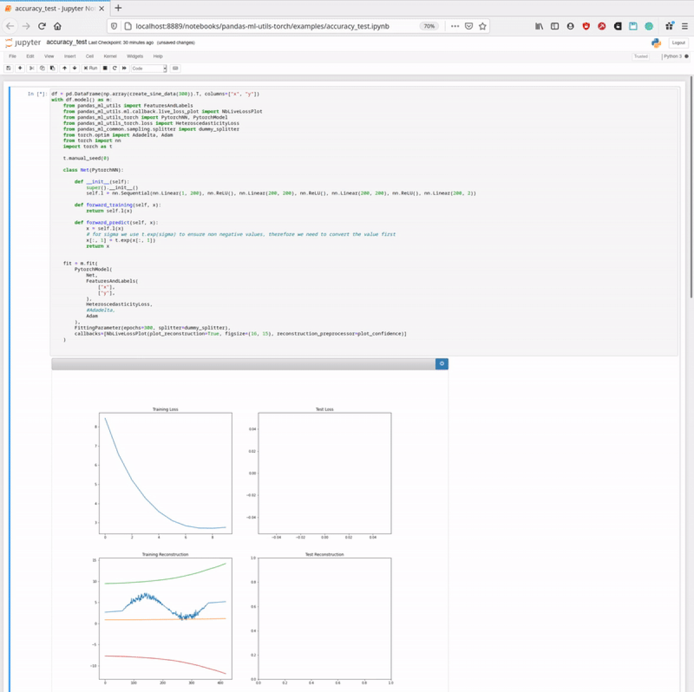
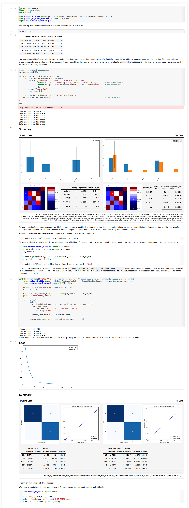
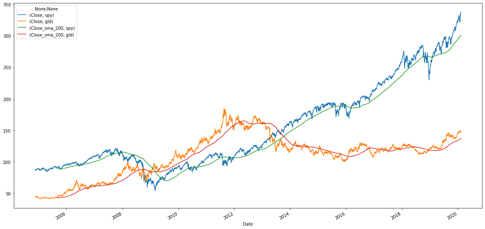
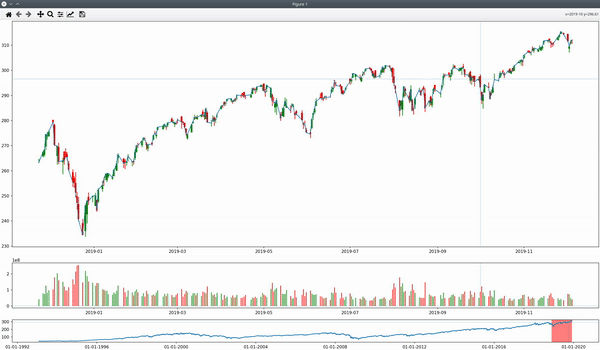

# Pandas Machine Learning and Quant Finance Library Collection

[](https://www.python.org/downloads/release/python-360/)
[](https://github.com/KIC/pandas-ml-quant/actions)

Whether it is some statistical analysis or machine learning, most likely it all starts with a `DataFrame`.
But soon enough you will find yourself converting your data frames to numpy, splitting arrays, applying min
max scalers, lagging and concatenating columns etc. As a result your notebook looks messy and became and 
unreadable beast. Yet the mess becomes only worse once you start to deploy your research into a productive
application. Now the untested hard coded data pipelines need to be maintained at two places. 

The aim of this library is to conveniently operate with data frames without and abstract away the ugly un-
reproducible data pipelines. The only thing you need is the original unprocessed data frame where you started.


You find this demo in the pytorch [examples](./pandas-ml-utils-torch/examles/)<br><br>

The data pipeline becomes a part of your model and gets saved that way. Going into production is as easy as this:

```python

import pandas as pd
import pandas_ml_utils  # monkey patch the `DataFrame`
from pandas_ml_utils import Model
# alternatively as a one liner `from pandas_ml_utils import pd, Model` 

model = Model.load('your_saved.model')
df = pd.read_csv('your_raw_data.csv')
df_prediction = df.model.predict(model)

# do something with your prediction
df_prediction.plot()
``` 

## Project Structure
The project is divided into several sub modules where each module could have its own life-cycle. It is definitely an
option to move the modules into their own repository in the future if there will be dedicated contributors.

The submodules are:
 * pandas-ml-1ntegration-test  more complex tests involving several modules and eventually external data
 * pandas-ml-airflow  a very experimental module to integrate models within apache airflow 
 * pandas-ml-common  functionalities around data access and preparation like train/test splitting, cross validation, ...   
 * pandas-ml-quant  enhancing pandas-ml-utils for modeling financial timeseries
 * pandas-ml-quant-rl  very experimental module for reinforcement learning
 * pandas-ml-utils  core module to train models directly from a pandas data frame
 * pandas-ml-utils-keras  deprecated module, might be revoked using tensorflow probability
 * pandas-ml-utils-torch  pytorch module for machine learning
 * pandas-quant-data-provider  easy wrapper around data providers like yahoo and investpy
 * pandas-ta-quant  technical analysis functionality like TA-Lib
 * pandas-ta-quant-plot  plotting library to simulate state of the art financial plots (also very early stage) 

### [pandas-ml-common](pandas-ml-common/Readme.md)
This module contains helpers and utilities for the most common tasks like:
* splitting data and generation of cross validation data sets
* nesting and un-nesting of multi dimensional column data like images or geo data
* helpers for pandas `MultiIndex`es 
* dependency injection
* data serialization 

### [pandas-ml-utils](pandas-ml-utils/Readme.md)
The main abstraction layer for data selection, preparation and modelling. The core object is the `FeaturesAndLabels` 
definition. Very high level your models will look something along the lines:

```python
from pandas_ml_utils import pd

df = pd.DataFrame({})
with df.model('file_name') as m:
    # use a context manager and import all your dependencies locally 
    # and create all objects needed for your model
    # this makes sure when you save (pickle) your model that it can load conveniently without polluting
    # your global name space   
    from pandas_ml_utils import SkModel, FeaturesAndLabels, FittingParameter, RegressionSummary, naive_splitter
    from sklearn.neural_network import MLPRegressor

    fit = m.fit(
        SkModel(
            MLPRegressor(activation='tanh', hidden_layer_sizes=(60, 50), random_state=42, max_iter=2),
            FeaturesAndLabels(
                features=[
                    "some_column",
                    lambda df: df["some_column"].apply(lambda x: "some calculation"),
                ],
                labels=[
                    lambda df: df["some_column"].apply(lambda x: "some calculation")
                ]
            ),
            summary_provider=RegressionSummary
        ),
        FittingParameter(naive_splitter())
    )

 
fit  # finally just return fit as the `Fit` object implements `_repr_html_()` which renders a nice report
```

Before a model can be developed, features need to be selected. 
```python
df.model.feature_selection(
    FeaturesAndLabels(
        features=[...],
        labels=[...]
    )
)
```

Check this demo from the [examples](./pandas-ml-utils/examles/):



### [pandas-ml-utils-toch](pandas-ml-utils-torch/Readme.md)
Extends the pandas-ml-utils library for the use of pytorch models

### [pandas-ml-utils-keras](pandas-ml-utils-keras/Readme.md)
Extends the pandas-ml-utils library for the use of keras tensorflow 1.x models. 

NOTE! This module is currently stalled as I mainly use pytorch at the moment.  

### [pandas-ml-quant](pandas-ml-quant/Readme.md) 
...

### [pandas-ta-quant](pandas-ta-quant/Readme.md) 
Technical analysis library


### [pandas-ta-quant-plot](pandas-ta-quant-plot/Readme.md) 
Charting library


 
### [pandas-ml-quant-data-provider](pandas-quant-data-provider/Readme.md) 
This is mainly a wrapper around data providing libraries [yfinance](https://github.com/ranaroussi/yfinance) 
or [investing](https://github.com/alvarobartt/investpy)

### Testing and experiments
There are some more not published libraries used for testing and experiments.
  
## Installation
Currently, all libraries are somewhat entangled and will hike parallel the releases cycles. This dependency will weaken up
as we reach more stable release. 

```bash
pip install pandas-ml-common pandas-ml-utils pandas-ta-quant pandas-ml-quant \
pandas-quant-data-provider pandas-ta-quant-plot
```

